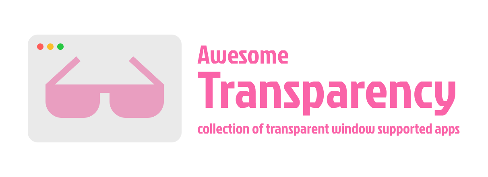

Translucent applications (apps with background transparency support) are awesome. Not only they look nice, they are also useful: you can have a fullscreen translucent note-taking application to take notes from a background browser saving huge screen real estate reducing the need of a second monitor.

## Legend

Support level:

- ✅ built-in configuration support
- 🛠️ with hacks, fork
- 🧩 with plugins

Other properties:

- ⚙️ dynamic (change transparency when app running)

https://github.com/brainwo/awesome-transparency/assets/45139213/c7dc4eba-8825-49f3-aba7-b273fbd5b026
  
- ➖ forced transparency (text and other contents are also transparent, not good)

## IDE/Code Editor

- 🧩 ➖ [Visual Studio Code](https://code.visualstudio.com/)
- ✅ [Neovide](https://neovide.dev/)

## Terminal Emulator

- ✅ ⚙️ [Kitty](https://sw.kovidgoyal.net/kitty/)
- ✅ [Alarcitty](https://alacritty.org/)
- 🛠️ [st](https://st.suckless.org/)

## Media Viewer

- ✅ [Zathura](https://pwmt.org/projects/zathura/) - document/ebook viewer
- 🛠️ [Nmodsxiv](https://github.com/BeyondMagic/nmodsxiv) - image viewer, fork of Nsxiv

## Utility

- ✅ [Rofi](https://davatorium.github.io/rofi/) - application launcher
- ✅ [Polybar](https://polybar.github.io/) - status bar

---

This work is license under CC0 1.0 Universal (CC0 1.0) Public Domain Dedication.
